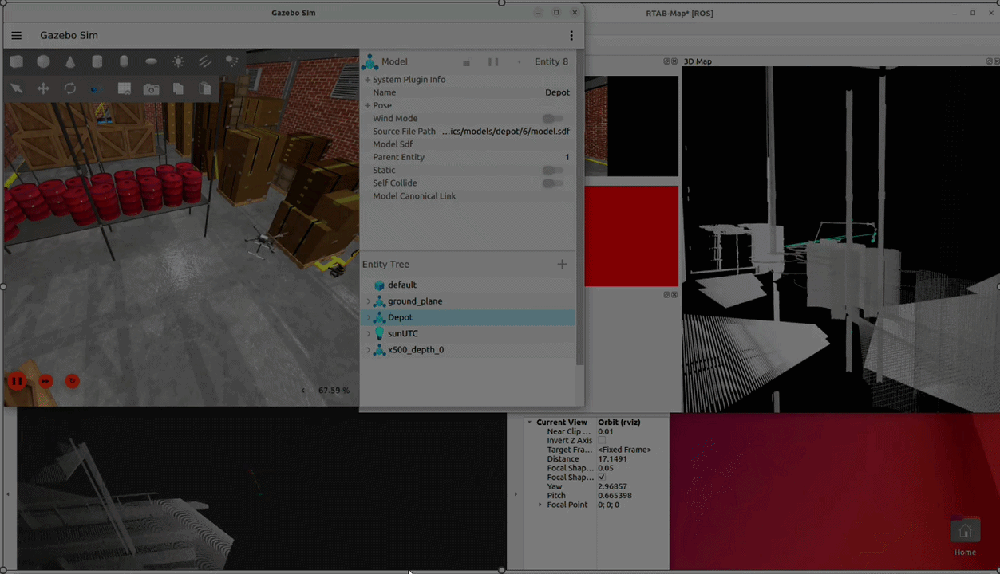
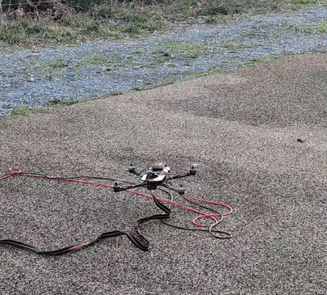
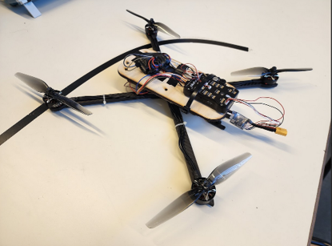
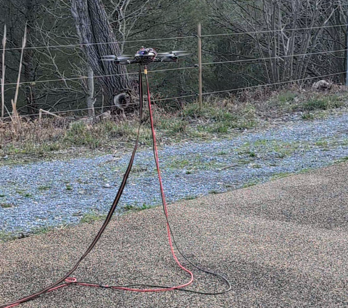
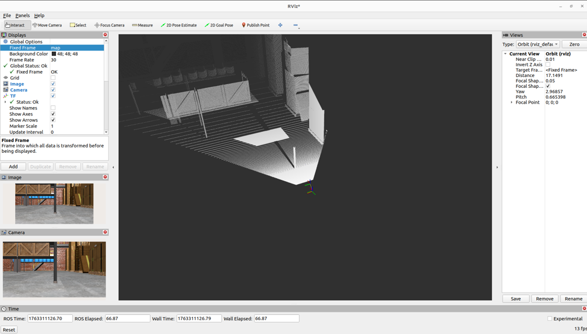
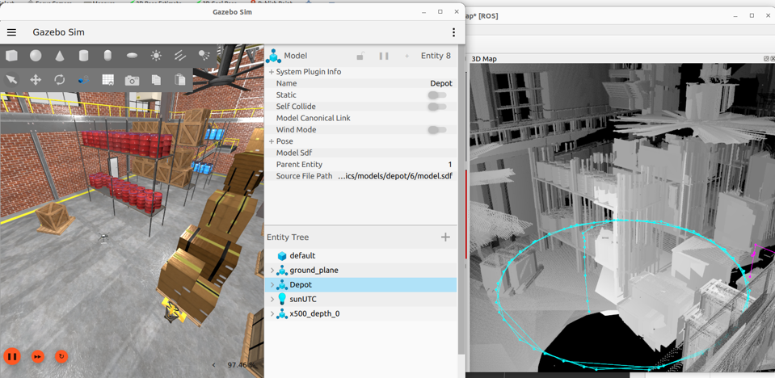

<p align="center">
  
</p>

> **Engineering Note:** This demonstration showcases the integration of the **ORB-SLAM3** algorithm for real-time 3D mapping in a **Gazebo** simulated environment. During the drone's initial vertical takeoff, a slight visual odometry drift can be observed (leading to a minor map duplication). This is a classic challenge in pure Visual SLAM, caused by the rapid loss of tracked ORB features on the ground during fast Z-axis acceleration. It highlights the importance of Visual-Inertial Odometry (VIO) fusion for stabilizing tracking during aggressive maneuvers.

<br>

<p align="center">
  
</p>

> **Engineering Note:** First real-world flight of the drone after PID calibration on a test bench, performed under significant wind conditions. For safety and compliance with school regulations, an external tether cable and a wired power supply were used instead of an onboard LiPo battery to mitigate potential risks.

<br>

<p align="center">
  
  
</p>

<p align="center">
  
</p>

<p align="center">
  
</p>

# 🚁 Autonomous Surveillance Drone - Simulation Workspace

This work was made by 3 persons:
- Nicolas Consalvi (Hardware setup / Simulation building & setup / SLAM 3D)
- Adrien Waeles-Devaux (Design of an EKF)
- Youssef Miri (AI : Computer vision YOLOv11 / Vocal Commands with LLM / reinforcement learning with MuJoCo)

This repository contains: 
- The complete **ROS 2 workspace** for the Autonomous Surveillance Drone project. It integrates **PX4 Autopilot (SITL)** with **Gazebo Garden/Harmonic**, a custom **TF tree**, and **RTAB-Map** for 3D SLAM.
- The **reinforcement_learning.zip**, which contains our reinforcement learning project : landing on a moving platform thanks to PPO algorithm.
- The Computer_vision (**computer_vision.zip**) & vocal commands (**final_alexa_agent.py**) codes.

**Note for the simulation:** All source codes/packages for TF management (`my_tf2_package`) and SLAM configuration (`rtabmap_slam_pkg`) are already included in this repository in the /src directory. You simply need to copy the repository into a ros2 workspace, build and launch them.

**#SETUP OF THE SIMULATION**

## 📋 Prerequisites & Base Setup

### 1. Base Installation (PX4 & ROS 2)

Before using this workspace, ensure you have a working installation of **ROS 2 Humble** and **PX4 Autopilot** on Ubuntu 22.04.
👉 **[Click here for the complete PX4 + ROS 2 + Gazebo Installation Guide](https://kuat-telegenov.notion.site/How-to-setup-PX4-SITL-with-ROS2-and-XRCE-DDS-Gazebo-simulation-on-Ubuntu-22-e963004b701a4fb2a133245d96c4a247)**

### 2. Additional Dependencies

Install **QGroundControl** to monitor the drone:

* [Download QGroundControl AppImage](https://docs.qgroundcontrol.com/master/en/qgc-user-guide/getting_started/download_and_install.html)

Fix Python compatibility for ROS 2 builds:

```bash
pip3 uninstall setuptools empy
pip3 install --user "setuptools>=30.3.0,<80" "empy<4"
